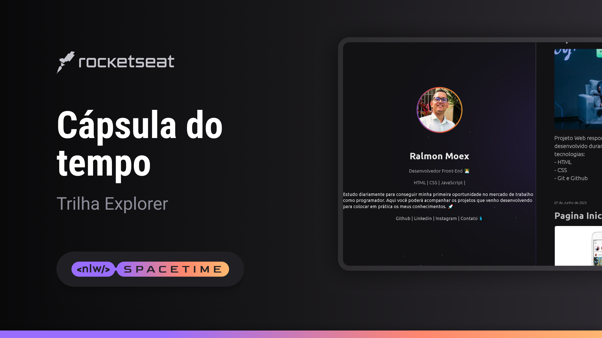

## 👨‍🚀 Projeto Capsula do Tempo NLW
Projeto Web responsivo desenvolvido durante o evento NLW Spacetime Explore da Rocketseat.

## 🚀 Tecnologias
Para o desenvolvimento desse projeto foi usado as seguintes tecnologias:

- HTML
- CSS
- Git e Github

## 🏷 Layout
Você pode visualizar o layout do projeto através [desse link](https://www.figma.com/file/ZhhGUTNP6sFTSFcHrHXvTw/C%C3%A1psula-do-tempo-%E2%80%A2-Trilha-Explorer-(Community)-(Copy)?type=design&node-id=306%3A84&t=w7gATnOddWbUH4At-1).
É necessario ter conta no [figma](https://www.figma.com)